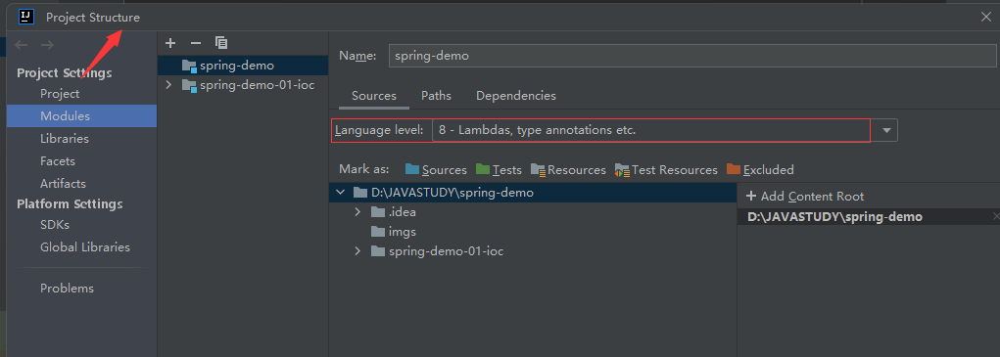
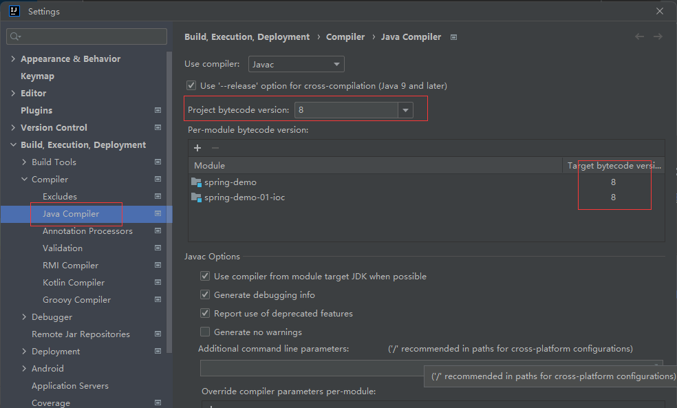

## 一 、基础知识
### 1、Dao层  
持久层，主要和数据库进行交互，创建DAO接口，然后会在配置文件中定义该类接口的实现类
### 2、service层
业务层，控制业务；和dao层一样，先设计接口，然后再设计实现类；主要负责业务模块的逻辑应用设计
### 3、controller层
主要调service层的接口，控制具体的业务流程
### 4、查找spring版本的文档
``` 
https://docs.spring.io/spring-framework/docs/5.2.1.RELEASE/spring-framework-reference/
```
### 5、spring AOP
#### 代理模式
- 静态代理
    - 先创建接口--把具体需要的功能列出来
    - 确定真实的对象
    - 找代理对象--代理对象可以自己定义功能需求，增加额外的附属条件，比如说中介费
    - 客户--找代理（创建真实的对象，扔到代理里面）
### 6、使用set和get（其实也就是封装，把属性封装起来，只提供对外访问的接口）
- 由于属性被私有化了，不能直接访问，所以需要set或者get
- set属性（属性首字母要大写）
```aidl
    private UserService userservice;//属性、变量类型
    public void setUserService(UserService userservice) {//setUserService大写
        this.userservice = userservice;
    }
```
```aidl
//私有属性，也可以设置有参的构造方法来进行传递对象
    private UserService userservice;//属性、变量类型
    public UserProxyService(UserService userservice) {
            this.userservice = userservice;
        }
```
## 二 、TipS
### 1、常用Archetype,
- maven-archetype-quickstart
- maven-archetype-webapp  //项目模板

### 2、常用spring依赖库
- spring-webmvc
```
<dependencies>
        <dependency>
            <groupId>org.springframework</groupId>
            <artifactId>spring-webmvc</artifactId>
            <version>5.2.1.RELEASE</version>
        </dependency>
    </dependencies>
```

```
 <!--照着改，eg：context，aop-->
       xmlns:context="http://www.springframework.org/schema/context"
       xmlns:aop="http://www.springframework.org/schema/aop"
       xsi:schemaLocation="http://www.springframework.org/schema/beans
       https://www.springframework.org/schema/beans/spring-beans.xsd">
```
### 3、idea使用技巧
- ctrl+ o  构造方法重载
- ctrl + l 实现

## 三、question: 
### 1、如果没有依赖，尝试右键刷新


### 2、java: 错误: 不支持发行版本 17/5  ----推荐使用jdk8
jdk18会出现中文乱码问题，不要使用，jdk17配置的时候出现：不支持发行版本 17，最好也使用jdk8；

步骤：改成jdk8






```
public Cat getCat(){
        return cat;
    }

    public Dog getDog(){
        return dog;
    }

    public String getName(){
        return name;
    }

    @Override
    public String toString() {
        return "People{" + "cat=" + cat + ", dog=" + dog + ", name=" + name + '\''+ "}";
    }
```

```aidl
<?xml version="1.0" encoding="UTF-8"?>
<beans xmlns="http://www.springframework.org/schema/beans"
       xmlns:xsi="http://www.w3.org/2001/XMLSchema-instance"
       xmlns:context="http://www.springframework.org/schema/context"
       xmlns:aop="http://www.springframework.org/schema/aop"
       xsi:schemaLocation="http://www.springframework.org/schema/beans
       https://www.springframework.org/schema/beans/spring-beans.xsd
       http://www.springframework.org/schema/context
       https://www.springframework.org/schema/context/spring-context.xsd
       http://www.springframework.org/schema/aop
       https://www.springframework.org/schema/aop/spring-aop.xsd">

        <!--开启注解的支持-->
       <context:annotation-config/>
    <bean id = "cat1" class = "com.jinli.pojo.Cat"/>
    <bean id = "cat2" class="com.jinli.pojo.Cat"/>
    <bean id = "dog123" class = "com.jinli.pojo.Dog"/>
    <bean id = "people" class="com.jinli.pojo.People"/>
```